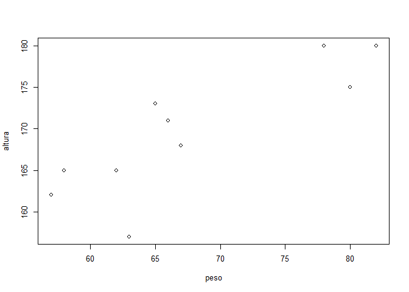
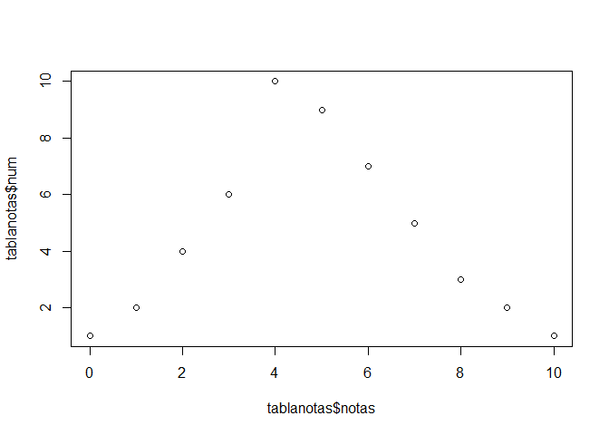
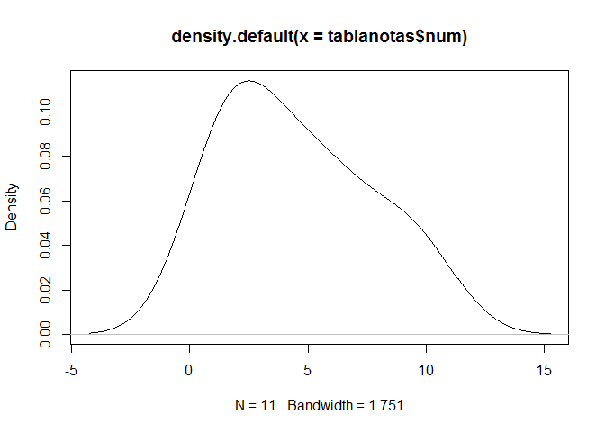
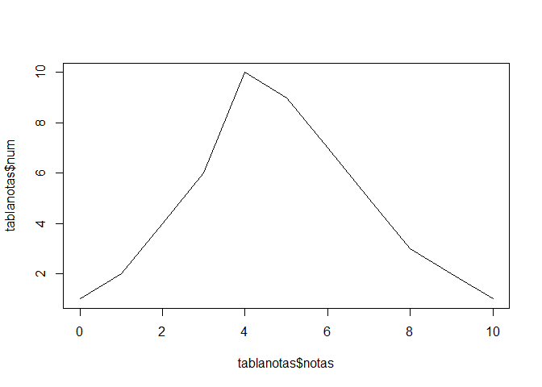
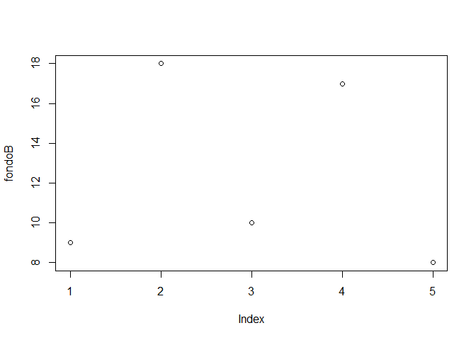
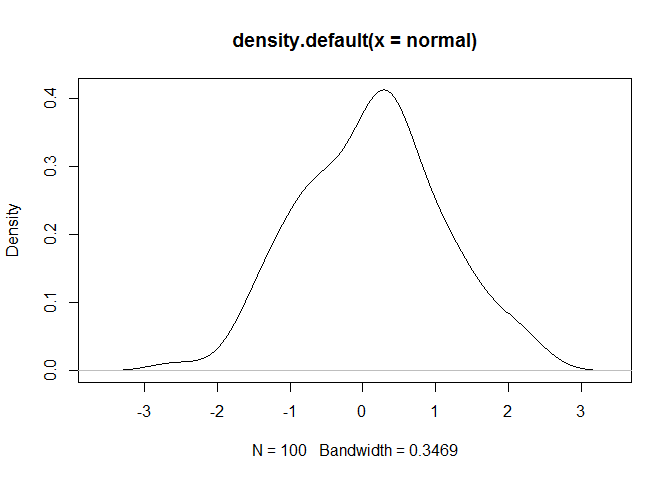

    memory.limit(30000)

    ## [1] 30000

    library(readxl)
    df <- read_excel("Ejercicios_AL_Montse.xlsx",sheet = 1)
    cov(df$altura,df$peso)

    ## [1] 58.13333

    cor(df$altura,df$peso)

    ## [1] 0.8456258

    par(cex=.8)
    plot(altura~peso, data=df)

    #abline(lm)
    lm <- lm(altura~peso,df)

Ley probabilidad Total Ejemplo

En el ramo de credito la probabilidad de que suceda un impago depende de
la economía. En el momento que se produce un impago se multiplica,
produce impagos en cadena.

ejemplo:

-   Suceso B: Economía va bien. P=0.6
-   Suceso M(complementario de B): Economía va mal. P=0.4
-   S siniestro(default), puede ocurrir en los dos anteriores:
    -   Cuando B: P(S|B)=0.1
    -   Cuando M: P(S|M)=0.5

Probabilidad incondicionada de que ocurra un siniestro

Probabilidad de que ocurra un siniestro y la econ estçe B + con la
economçia mal P(S|B)*P(B)+P(S|M)*P(M) Es una suma ponderada.

    P <- 0.6*0.1+0.4*0.5
    P

    ## [1] 0.26

Teorema de Bayes

sabiendo la probabilidad de tener un dolor de cabeza dado que se tiene
gripe, se podría saber (si se tiene algún dato más), la probabilidad de
tener gripe si se tiene un dolor de cabeza. Muestra este sencillo
ejemplo la alta relevancia del teorema en cuestión para la ciencia en
todas sus ramas, puesto que tiene vinculación íntima con la comprensión
de la probabilidad de aspectos causales dados los efectos observados.

Sea {{A\_{1},A\_{2},...,A\_{i},...,A\_{n}}} {A\_1, A\_2, ..., A\_i, ...,
A\_n} un conjunto de sucesos mutuamente excluyentes y exhaustivos, y
tales que la probabilidad de cada uno de ellos es distinta de cero (0).
Sea B un suceso cualquiera del que se conocen las probabilidades
condicionales {P(B|A\_{i})} P(B|A\_i). Entonces, la probabilidad
{P(A\_{i}|B)} P(A\_i|B) viene dada por la expresión:

{P(A\_{i}|B)={}} {P(A\_{i}|B)={}}

donde:

{P(A\_{i})} P(A\_i) son las probabilidades a priori, {P(B|A\_{i})}
P(B|A\_i) es la probabilidad de {B} B en la hipótesis {A\_{i}} A\_i,
{P(A\_{i}|B)} P(A\_i|B) son las probabilidades a posteriori.

Ejercicio:

P(Pos|E)=0.99 P(NoPos|E)=0.01 P(NoPos|NE)=0.95 P(Pos|NE)=0.05
P(E)=0.0001 (tienes enfermedad) P(NE)=0.9999 (no tienes enfermedad)

Probabilidad de que esté enfermo cuando me han hecho el test y sale
posivo

P(E|Pos)=P(Pos|E)\*P(E)/P(pos)

P(pos)=P(E)*P(pos|E)+P(NE)*P(pos|NE)=0.001*0.99+0.9999*0.05
P(E|Pos)=0.99\*0.001/P(pos)=0.002

    ppos <- 0.0001*0.99+0.9999*0.05
    pepos <- 0.99*0.0001/ppos
    pepos

    ## [1] 0.001976285

**Variable aleatoria**

X a cada suceso del espacio muestral le asignamos un numero real.

Si saco cara 0, saco cruz 1. (discreta)

    notas <- c(0,1,2,3,4,5,6,7,8,9,10)
    num <- c(1,2,4,6,10,9,7,5,3,2,1)
    tablanotas <- data.frame(notas,num)
    tablanotas

    ##    notas num
    ## 1      0   1
    ## 2      1   2
    ## 3      2   4
    ## 4      3   6
    ## 5      4  10
    ## 6      5   9
    ## 7      6   7
    ## 8      7   5
    ## 9      8   3
    ## 10     9   2
    ## 11    10   1

    tablanotas$freq <- tablanotas$num/50
    tablanotas$freqcum <- cumsum(tablanotas$freq)
    plot(tablanotas$notas,tablanotas$num)

**Distribución Probabilidad**

Es un acumulado P(X&lt;=x). F(3)&gt;=F(2) no decreciente

    tablanotas$notas <- as.numeric(tablanotas$notas)
    library(graphics)
    plot(density(tablanotas$num))

    plot(tablanotas$notas,tablanotas$num,type="l")

Para trabajar camos a considerar las variables continuas intervalos,
entre 100 y 150. La probabilidad puntual va a ser 0. Vamos a utilizar la
función de densidad.

Manejamos intervalos:

Lo que se calcula es el area, entre a y b, ese area nos dará la
probabilidad, la función de densidad nos dice la altura de esa región
para la que calculamos la probabilidad.

Media variables discretas

Suma de x \* probabilidad

    x <- c(-2,0,1,4)
    prob <- c(0.1,0.4,0.3,0.2)
    tablasprob <- data.frame(x,prob)

    tablasprob$producto <- tablasprob$x*tablasprob$prob
    sum(tablasprob$producto)

    ## [1] 0.9

En variables continuas funciona con la densidad.

Ejemplo:

TEmporada en la NBA.Salen parcialmente mejores resultados para Kobe pero
el total es para Pau.

En la primera kobe tiró 200 veces y acertó 60 =0.3 En la primera Pau
tiró 100 veces y acertó 29 = 0.29

En la segunda mitad kobe tiró 100 veces y acertó 40 = 0.4 En la segunda
mitad Pau tiró 200 veces y acertó 78 =0.39

Toda la temporada son 300 tiros 100 = 0.33 Toda la temporada Pau 300
tiros y acertó 107 = 0.35666

Ejemplo VARIANZA y DESVIACION TIPICA

    A <- c(-1000,-500,-100,1,1604)
    B <- c(-3,-2,5,2,3)
    mean(A)

    ## [1] 1

    mean(B)

    ## [1] 1

    var(A)

    ## [1] 958203

    var(B)

    ## [1] 11.5

    sd(A)

    ## [1] 978.8784

    sd(B)

    ## [1] 3.391165

    sqrt(var(A))

    ## [1] 978.8784

    sqrt(var(B))

    ## [1] 3.391165

La poblacion no la solemos tener, se usan muestras. La varianza tiene de
coeficiente N y la desviación N-1

Ejemplo fondos de inversión:

    año <- c(1,2,3,4,5)
    fondoA <- c(10,12,15,13,12)
    fondoB <- c(9,18,10,17,8)
    fondos <- data.frame(año,fondoA,fondoB)
    sd(fondos$fondoA)

    ## [1] 1.81659

    sd(fondos$fondoB)

    ## [1] 4.722288

Tiene más dispersión el fondo B, puedo tener más riesgo.

    library(e1071)

    ## Warning: package 'e1071' was built under R version 3.3.3

    plot(fondoB)

    kurtosis(fondoA)

    ## [1] -1.548099

    kurtosis(fondoB)

    ## [1] -2.206573

    skewness(fondoA)

    ## [1] 0.1281121

    skewness(fondoB)

    ## [1] 0.2557095

Si la distribucion es simetrica y si es más aplanada, si es puntiaguda
hay acumulacion de observaciones con el mismo valor. La kurtosis la
tendremos en cuenta sobretodo en distribuciones simétricas.

### Prima pura

Es la esperanza de la siniestralidad. La ley de los grandes números, al
tener una muestra grande es muy importante.

Normalización Datos para igualarlos y así poderlos estudiar y
relacionar.

dato-media/desviacion

DISTRIBUCIONES VARIABLES DISCRETAS
----------------------------------

### Bernoullli

Dos posibilidades Exito/fracaso

La media es **P**, probabilidad de exito. La varianza es **PxQ**
probabilidad de cara x probabilidad de cruz

### Binomial

Repetición de experimentos de Bernoulli independientes. B(n,p) número de
veces que tiro la moneda, probabilidad de éxito.

Cada póliza es un experimento, si uno tiene siniestro no me afecta a los
otros, son independientes. n=1000 polizas p= probabilidad de que este
vivo al cabo del año

Probabilidad de obtener k éxitos en n repeticiones. cada éxito tiene
probabilidad p. Carteras homogeneas (todos los de 80 años es una
binomial, grupos para cada p igual). Separo para hacer homogenea la
cartera.

La variable binomial puede coger valores entre 0 y n.

Ejercicio:

P=0.7 Q=0.3 n=10

P(X=10) P(X=0) P(X=8) P(X=&gt;2)

dbinom me da la probabilidad de exactamente tener 10 exitos, pbinom me
da el acumulado (10,9,8....)

    dbinom(10,10,0.7)

    ## [1] 0.02824752

    dbinom(0,10,0.7)

    ## [1] 5.9049e-06

    dbinom(8,10,0.7)

    ## [1] 0.2334744

    pbinom(10,10,0.7)-pbinom(1,10,0.7)

    ## [1] 0.9998563

Cuando n es grande la forma de la distribucion es la normal.

### Poisson

Seguimos en procesos dicotomicos. Son independientes. La probabilidad de
exito es pequeña y el numero de repeticiones muy grande p&lt;0.1 n&gt;50

Cuando la p es pequeña tenemos la poisson, es una modalidad extrema de
binommial. Mayor facilidad de uso.

media=varianza

Ejemplo:

media=2 n=5 p(x&gt;5)?

    1-ppois(5,2)

    ## [1] 0.01656361

### Aproximación de la Binomial mediantePoisson

Es buena para modelizar el numero de siniestros en una póliza. Porque la
probabilidades de siniestro son pequeñas.

Tengo 20000 asegurados, probabilidad de que haya mas de 3 siniestros. La
probabilidad fallec de ese tipo de accidente es 0,03%.

    n <- 20000
    p <- 0.0003
    menos3siniestros <- pbinom(3,20000,0.0003)
    masdetresiniestros <- 1-menos3siniestros
    masdetresiniestros

    ## [1] 0.8488363

    media <- n*p
    media

    ## [1] 6

    varianza <- n*p*(1-p)
    varianza

    ## [1] 5.9982

La media y la varianza son iguales puedo usar la poisson.

F(3) con la poisson, buscamos la diferencia 1-F(3), nos da la
probabilidad de que sea mayor que 3.

Conforme lambda va subiendo se vuelve más simétrica. Distribucion
clasica para modelizar el número de siniestros.

### Binomial Negativa

Dos resultados posibles, se repite n veces de forma independiente.
Exito/Fracaso.

Que distribución utilizar?

-   si la varianza es más pequeña que la media usaré la binomial
-   si coinciden, usaré poisson
-   si es mayor que la media, utilizaré la binomial negativa
    (hay sobredispersión)

Aseguramos hundimiento barcos, flota 10000 barcos, valor unitario 0,6.
Siniestros independientes- Probabilidad de siniestro total es 0,001
anual. X es el número de barcos hundidos al año.

    n <- 10000
    p <- 0.001
    media <- n*p
    varianza <- n*p*(1-p)

Media y varianza son iguales, podemos utilizar la binomial o la poisson.

Reservas de la aseguradora para poder afrontar sus compromisos con una
probabilidad del 99,9%

    #siniestralidad <- P(X*0.6<Reservas)=0.999
    #X numero de barcos hundidos por su valor
    #P(X<Reservas/0.6)=0.999
    #La función de distribución me da la probabilidad acumulada. Tenemos X y su probabilidad, 0 siniestros y su probab, 1 siniestro y su probab, 3 siniestros...a cada valor de la variable le doy una probabilidad.
    #La función inversa de la Funció de distribución, el punto de partida son probabilidades, para una probabilidad de 0.01 que valor de la variable le corresponde.
    En nuestro problema queremos la inversa de la binomial, para una probabilidad me dice el valor de la variable.

La probabilidad de tener 21 o menos siniestros es 0.999

    qbinom(0.999,10000,0.001)

    ## [1] 21

    reservas <- 21*0.6
    reservas##millones

    ## [1] 12.6

Si una aseg. B se encuentra en la misma situación que A. Tiene 10000
buques, p=0.001. Se fusionan los dos que reservas necesitan?

    n <- 20000
    p <- 0.001
    qbinom(0.999,20000,0.001)

    ## [1] 35

    Reservas <- 35*0.6
    Reservas

    ## [1] 21

Se podría hacer con la inversa de la poisson.(no está en excel)

### Variables Continuas

#### Distribución uniforme

Intervalo finito, cada valor del intervalo es equiprobable. El
lanzamiento de un dado.

Función de densidad cte, diferencia entre dos extremos.

f(x)=1/b-a

Esperanza =b+a/2 Varianza=

Se utiliza en la **simulación de Montecarlo**. Simular números entre 0 y
1. Generamos números aleatorios, aplicamos la función inversa, obtenemos
valor. Volvemos a generar...

Función aleatorio() en Excel.

Esta distribución se utiliza para simular costes de siniestros, precios
de valores financieros, etc...

### Distribución gamma (alfa y beta)

media=alfa/beta

La distribución tiene diferente forma dependiendo de esos valores.

### La Normal

Sus parámetros son la media y la varianza. Tiene buenas propiedades
matemáticas, por eso se tiende a utilizar esta distribución cuando los
datos no se ajustan a ella.

Propiedades:

-Transformación lineal Si X~N(media, varianza) y a y b ctes.
Y=aX+b~N(a*media+b,a^2*b^2)

Sus valores posibles estan entre -infinito y +infinito, los valores
extremos son improbables por eso tiene colas ligeras. Atribuye muy poca
probabilidad a los valores extremos. Depende de la varianza será mas
achatada o más puntiaguda.

Normalización de datos:

X-media/sdt = nueva media=0 y sdt=1

Ejemplo:

Calcular P(X&gt;-1.37)=1-P(X&lt;=1.37)

Z~N(0,1)

En excel DISTR.NORM.ESTAND.N

Es la distribucion de media 0 y desviacion 1, la probabilidad de que los
valores de X queden a la izquierda de 1.26 es 0,896

    pnorm(1.26)

    ## [1] 0.8961653

    1-pnorm(1.26)

    ## [1] 0.1038347

    #P(Z<0.86)
    pnorm(-0.86)

    ## [1] 0.1948945

    1-pnorm(-1.37)

    ## [1] 0.9146565

    pnorm(0.37)-pnorm(-1.25)

    ## [1] 0.538659

100 números aleatorios con distribución normal:

    normal <- rnorm(100,0,1)
    d <- density(normal)
    plot(d)

Ahora tengo la probabilidad de que sea mayor que z

P(Z&gt;z)=0.05=F inversa(0.95) nos da Z

    qnorm(0.95)

    ## [1] 1.644854

Partimos de la probabilidad y obtenemos el valor.

En variables continuas, crea rangos, calculo frecuencias para cada
rango. Entre 10 y 15 tenenmos 8 casos....

Ejercicio 9:

Demanda de un producto con distrib normal, media 250 desviación 70.
Calcular X (inventario producto) para que la probabilidad de que la
existencia se agote no sea mayor que 0.05

    qnorm(0.95,250,70)

    ## [1] 365.1398

    1-pnorm(365.1398,250,70)

    ## [1] 0.04999993

Nos da el numero X para que no me quede sin existencias con una
probabilidad de 0.05 son 366 unidades.

#### Propiedad aditiva de la Normal

Si tengo dos distribuciones normales, la suma de X será una normal con
media=suma de medias y varianza=suma varianzas.

### LOG-NORMAL

X=e^w W es una normal

log X=w=N(media,varianza)

La siniestralidad tiene un tope que es 0. Es asimetrica con cola a la
derecha.

    log(normal+1)

    ## Warning in log(normal + 1): Se han producido NaNs

    ##   [1] -1.065509840  0.661485056 -2.782173747          NaN  0.636776395
    ##   [6] -0.285866604  0.707461969  0.082683835 -0.827712586  0.414577924
    ##  [11] -0.415728982  0.204328873          NaN          NaN -0.494618011
    ##  [16] -0.074289310  0.397468989 -1.190803045  0.382550239          NaN
    ##  [21]  0.802678902 -1.618997468          NaN  0.088305296  0.375133597
    ##  [26]          NaN  1.153594402 -0.360878844  0.312340343  0.786262906
    ##  [31]  0.862404015  0.335853157 -3.032630050 -0.982234919 -0.300741211
    ##  [36]  0.077944538 -1.006366066 -0.219342378  0.165003257 -1.256874331
    ##  [41]  0.487235965 -0.868615011 -1.468958603  0.384843402  0.371248853
    ##  [46]  1.015766181  0.285342428  0.225498613  0.605943613          NaN
    ##  [51]  0.931458608  0.582708703 -1.987513486 -0.861077252 -0.079218787
    ##  [56]          NaN -0.580703287  0.078076364  0.820886827  0.114823395
    ##  [61]          NaN  0.835002171  0.435483886  0.355515549  0.718049462
    ##  [66]          NaN  0.275933448  0.074960692  0.337212322          NaN
    ##  [71]          NaN  0.967235508  0.683801004 -0.389638991 -0.024681951
    ##  [76] -2.407532916 -0.027599125  0.164640006  1.213841204  0.196374635
    ##  [81] -4.517656082  1.133326904  0.393308161  0.299303100  0.373032731
    ##  [86]  0.851372770  1.118678038 -0.910861788  0.594507349 -0.179610459
    ##  [91] -0.009039676  1.048117483  0.914256310  0.731700756  0.637989395
    ##  [96]  0.571227620  0.210996892  0.432374805 -1.391637173  0.440016876

### Gi Cuadrado

Suma de variables aleatorias independientes N(0,1) al cuadrado. Conforme
aumentan los grados de libertad se vuelve más simétrica.

### T de Student

Deriva de una normal. Z es un Gi cuadrado con n grados de libertad. T
student tiene forma simétrica en funcion de los grados de libertad (k)
más se aproxima a la normal. tiene colas mas pesadas que la normla. Si
el número de grados de libertad es grande las probabilidades en la cola
= normal. Sino es más grande que la normal. k=10 ya casi es normal.

### El teorema dentral del límite (TCL)

Media muestral es una variable aleatoria porque depende de los valores
que haya cogido en la muestra. La media poblacional no lo conozco. Da
igual la distribución de la población, las medias muestrales siguen una
normal con media la media poblacional y varianza la desviacion tipica
muestral dividido raiz de n de la muestra. Usaremos la media muestral y
la std muestral-

El teorema es aplicable a la suma de los elementos de la muestra.
Ñ(n*media poblacional,raiz de n * std) esto es media muestral\*n

Ejemplo:

Distribución media muestral obtenida al lanzar dos dados, en comparación
con la de tirar un dado.

La suma de los valores de tirar dos dados va de 2 a 12, me puede salir
desde dos unos a dos seises.

P(1/6)\*P(1/6)=1/36 P(2,1)P(1,2)=1/36+1/36=2/36

Cuando n tiende a infinito, podemos calcular cualquier distribucion como
una normal.

Ejercicio 10:

La siniestralidad es una suma de siniestros, en una muestra lo sumo.
Tenemos siniestros punta. LA normal va de -infinito a +infinito. No es
aplicable a la siniestralidad. Es asimétrica con cola a la derecha
(log-normal?).

### Variables n-dimensionales

Distribución conjunta, la probabilidad conjunta nos mide que X1 sea
menor = que x1....

Distribucion marginal, es la individual de cada v.a

**Bivariante**

Calculo en lugar del area el volumen. Tengo la var. X e Y.

-   Normal Bivariante, las dos distribuciones marginales son
    normales, indep. entre ellas. cada altura igual, igual densidad
    de probabilidad.

### DEPENDENCIAS

Tabla correlación: datos recogidos de 100 personas. Con los datos
absolutos y el total, obtengo la frecuencia.

Y=RENTA X=EDAD

    ##Probabilidad de 500euros con 25 años
    0.15/0.27

    ## [1] 0.5555556

**Media de Y condicionada a que X=25:** Que sueldo puedo esperar si
tengo 25 años. 500*0.15+600*------

**MEdia de Y sin condicionar:**
P(500)+P(600)+P(700)=500*0.44+600*0.38+700\*0.18

#### COVARIANZA

Lo importante es el símbolo, son dependencias lineales, siempre la misma
inclinación, la no lineal no la captura la covarianza:

-   positivo: incrementa x e incrementa y
-   Negativa: incrementa x e disminuye y (en vida)
-   0: Son independientes linealmente. Pueden ser dependientes
    no linealmente.

Es un indicador limitado.

#### COEFICIENTE CORRELACIÓN PEARSON

r=Cov(X,Y)/sdt(x)\*std(y)

Cuanto más cerca de 1 está más dependiente es, =1 es dependencia
perfecta. -1 dependencia perfecta negativa. 0 son independientes
lineales.

    altura <- c(175,180,162,157,180,173,171,168,165,165)
    peso <- c(80,82,57,63,78,65,66,67,62,58)
    datos <- data.frame(altura,peso)
    cor(datos$altura,datos$peso)

    ## [1] 0.8456258

    cov(datos$altura,datos$peso)

    ## [1] 58.13333

Coeficiente correlacion de pearson es cercano al 1, estan muy
correlacionadas positivamente, cuando aumenta la altura, aumenta el
peso.

#### PRODUCTO DE MATRICES

    a <- matrix(c(2,4,7,1,1,6,2,3,3,5,3,2),nrow=4,ncol=3)
    b <- matrix(c(1,2,3,4,6,8),nrow=3,ncol=2)
    a

    ##      [,1] [,2] [,3]
    ## [1,]    2    1    3
    ## [2,]    4    6    5
    ## [3,]    7    2    3
    ## [4,]    1    3    2

    b

    ##      [,1] [,2]
    ## [1,]    1    4
    ## [2,]    2    6
    ## [3,]    3    8

#### Método Varianza-Covarianza

Si los riesgos a agregar son normales, la correlación capta bien la
dependencia.

Ejercicio 12:

    marketrisk <- 1500#percentil 99.5
    nonliferisk <- 800
    liferisk <- 300
    d <- data.frame(marketrisk,nonliferisk,liferisk)

Matriz de correlaciones?

Dependencia en la cola. Calculando capital el interés está en las colas
donde figuran los valores extremos.

Vamos a utilizar la correlación, es lo que usa solvencia II.

### Value at Risk (VaR)

Es una medida de riesgo. Es la más usual. Horizonte será un año con
nivel de confianza 99,5. VaR pérdida que no será excedida en un año con
el 99.5

p=0.995 m=100 std=150

    qnorm(0.995,100,150)

    ## [1] 486.3744

Estas pérdidas se calculan a un día, depende de si los datos son diarios
o anuales.

Probabilidad de tener pérdidas menores o iguales a 486.3744 es 99.5 Con
este capital me estaré cubriendo con una probabilidad del 99.5 Si es de
cola larga no refleja bien el riesgo.

m=VaR

m(X)+m(Y)&gt;= m(X+Y)

Se calcularan dos partes, para resolver el problema que tiene var:

-   SCR
-   CAT (riesgo catastrófico calculado por separado para esa cola)

VaR histórico

Utilizamos los valores históricos para calcular el VaR e incorporar la
no linealidad, no vamos a ajustar ninguna distribución. Ejercicio 14.

### Tail Var o Expected Shortfall

Te hace la media de las pérdidas a partir de cierto percentil. Pero no
se ha elegido el Tail Var porque tenemos pocos datos externos, se podria
meter un gran error.

Ejercicio 15:

Ajustar una distribución, coges todos los valores posibles que a lo
mejor tu muestra no tiene. Muchas veces separas tu muestra en dos, los
extremos los separas.

Cartera con 100000 coches, la probabilidad de siniestro es 0.01 debería
separar mi cartera entre conductores buenos y malos, vamos a suponer que
esta son regulares. La varianza es mas pequeña que la media, es una
binomial. Una poliza puede tener mas de un siniestro, lo suyo es hacer
simulaciones de siniestro para cada poliza (poisson lo hace). Cada coche
puede tener 0 siniestros, 1, 2, 3....

Uso la inversa de la binomial y al mismo tiempo creo numeros aleatorios.

calculo 500 posibles cifras de siniestros de mi cartera, binomial
aleatorio. La probabilidad la calculare con una distribucion binomial
normal, numero de exitos es el numero siniestros, en acumulado pongo
falso porque no queremos acumulado.
